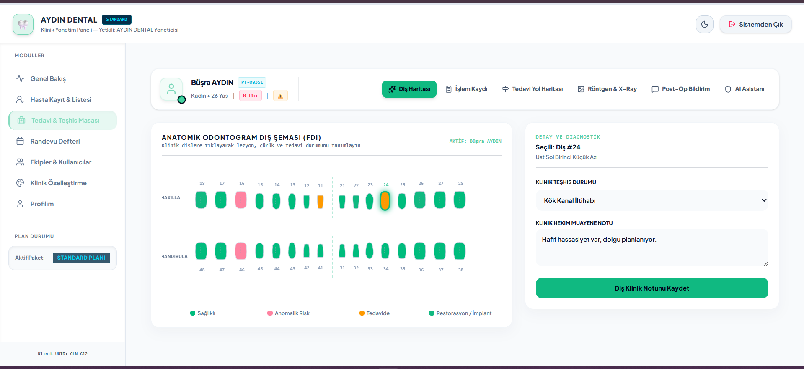
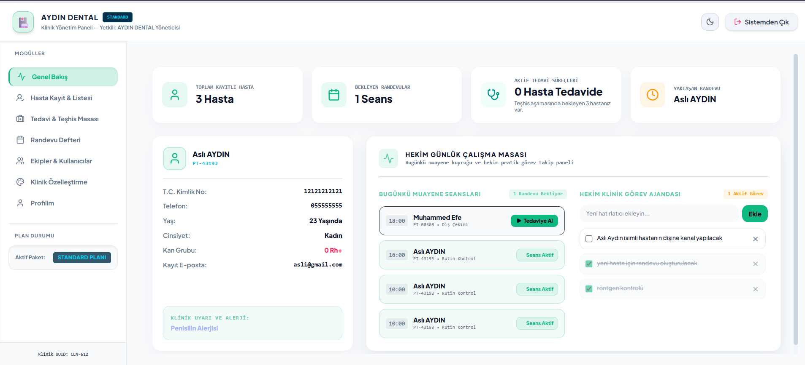
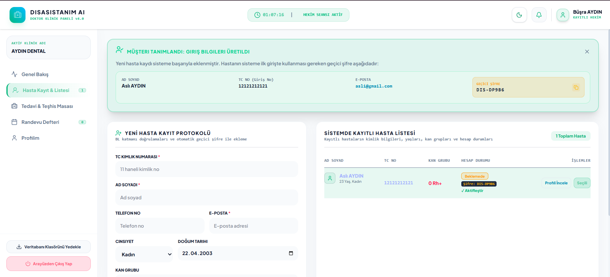
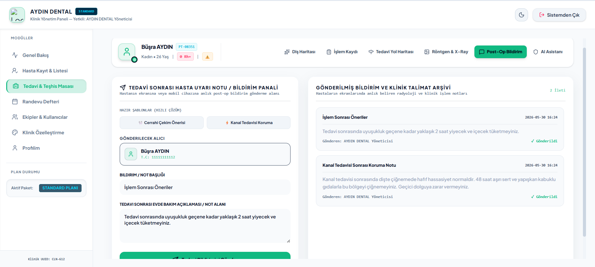
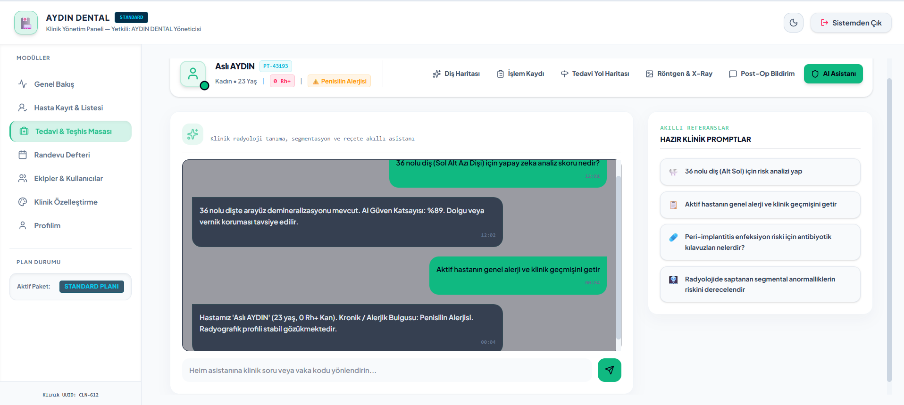
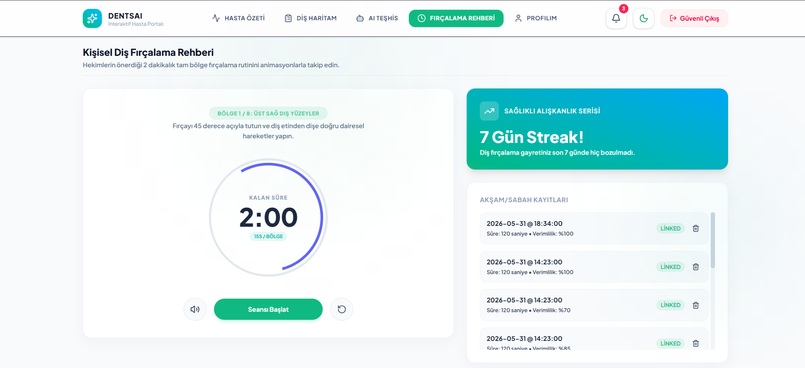
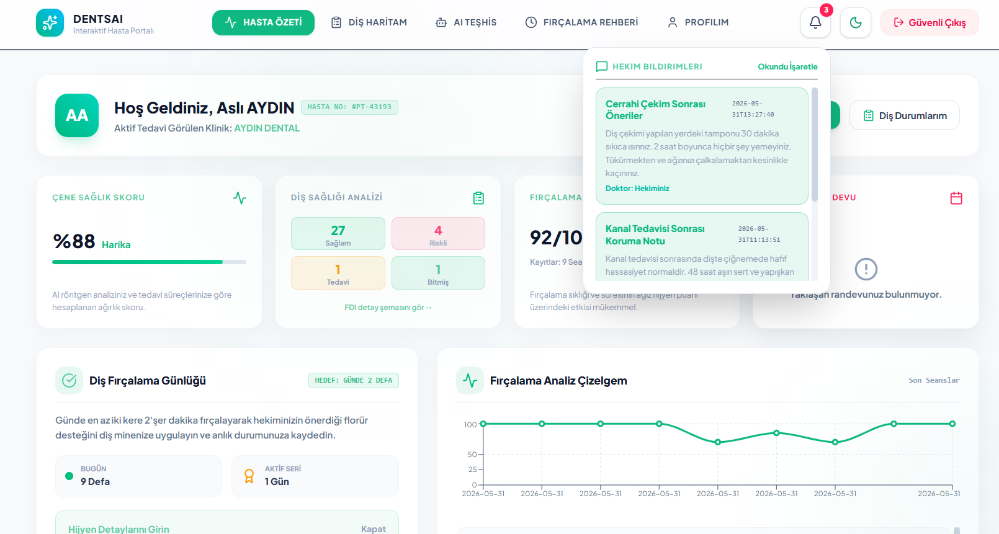
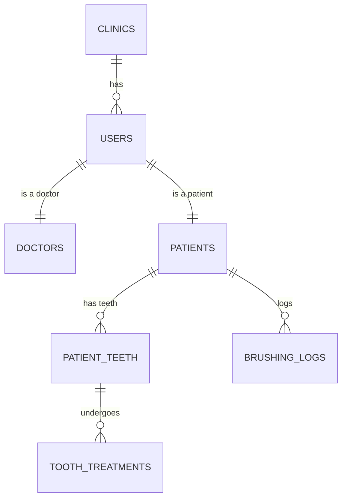

# 🦷 DentsAI - Yapay Zeka Destekli Diş Kliniği Otomasyonu

  
  
  

---

## 📝 Proje Özeti (About The Project)

**DentsAI**, modern diş hekimliği kliniklerinin operasyonel ihtiyaçlarını karşılamak ve hasta-hekim ilişkisini dijitalleştirmek amacıyla tasarlanmış, **HealthTech** standartlarında, çok kiracılı (**Multi-Tenant SaaS**) mimariye sahip uçtan uca bir diş kliniği otomasyon platformudur.

Platform, iki temel katmandan oluşur:
*   **Hekim Katmanı**: Teşhis, tedavi, randevu defteri, SaaS limitleri ve klinik kaynak yönetimi gibi kritik klinik süreçlerin yürütülmesini sağlar.
*   **Hasta Katmanı**: Tedavi yol haritası, eşzamanlı güncellenen interaktif diş şeması, kişisel ağız hijyeni rehberi (akıllı fırçalama günlüğü) ve çene sağlık skorlarının takip edildiği interaktif bir arayüz sunar.

Sistem, SaaS gereksinimlerine uygun olarak tasarlanmış olup, farklı kliniklerin verilerini tamamen izole eden (**Tenant Isolation**) bir veritabanı altyapısına sahiptir.

---

## 🚀 Temel Özellikler (Key Features)

### 👨‍⚕️ Hekim Portali
*   **FDI Anatomik Diş Haritası (Odontogram)**: 32 dişin her biri için vektörel SVG odontogram üzerinden detaylı durum seçimi (Sağlam, Risk Altında, Tedavili, Tamamlandı).
*   **Branşlara Göre Gruplanmış Müdahale Seçimi**: Teşhis ve Radyoloji, Restoratif, Endodonti, Periodontoloji, Cerrahi, Protez ve Pedodonti branşlarında gerçek tıp terminolojisine uygun, kategorize edilmiş zengin işlem kütüphanesi.
*   **Randevu Defteri**: Hekim ve hasta eşleşmeli, durum renk kodlu dinamik randevu yönetimi.
*   **SaaS Yönetim ve İstatistik Bento Kartları**: Hekim panelinde aktif tedavileri ve teşhis bekleyen hastaları dinamik olarak izleyen bento kartları.

### 👤 Hasta Portali
*   **Anatomik Diş Şeması (SVG)**: Üst çene (Maxilla) ve alt çeneyi (Mandibula) yatay iki sıra halinde gösteren, hasta yönlerini (Sağ/Sol) belirten sadeleştirilmiş anatomik odontogram şeması.
*   **İnteraktif Bilgi Kartı & Zaman Tüneli**: Odontogramda seçilen dişe hekim tarafından girilen klinik notu, teşhisi ve o dişe uygulanan eski tedavileri zaman tüneli (timeline) olarak görüntüleme.
*   **Ağız Hijyeni Günlüğü**: Sesli/görsel rehberlik sunan 2 dakikalık akıllı fırçalama zamanlayıcısı ve diş ipi, dil temizliği parametrelerini içeren fırçalama günlüğü kayıt formu.
*   **Ağız Sağlığı Analizi**: Algoritma destekli çene sağlık skoru ve fırçalama alışkanlığı puanlaması.
*   **Fırçalama Analiz Çizelgesi**: Recharts kütüphanesi ile oluşturulmuş, hastanın son fırçalama seanslarının skor gelişimini gösteren kronolojik çizgi grafik.

---

## 📸 Ekran Görüntüleri (Screenshots)

  <h3>👨‍⚕️ Hekim Portali</h3>
  
Gelişmiş FDI Odontogram, Randevu Yönetimi ve Bento Kart İstatistikleri

  
  
  
  
  

  <h3>👤 Hasta Portali</h3>
  
İnteraktif Diş Şeması, Ağız Hijyeni Günlüğü ve Fırçalama Analiz Grafiği

  
  

---

## 🛠️ Kullanılan Teknolojiler (Tech Stack)

### Arayüz Katmanı (Frontend)
*   **Core**: React 19, TypeScript, Vite.
*   **Styling**: Tailwind CSS (CSS Değişkenleri ile dinamik tema/HEX kurumsal renk uyumluluğu).
*   **Grafik & Görselleştirme**: Recharts (Fırçalama analizleri çizelgesi).
*   **Animasyonlar**: Motion (Framer Motion).
*   **İkon Seti**: Lucide React.

### Sunucu Katmanı (Backend)
*   **Framework**: Python, FastAPI (Asenkron API mimarisi).
*   **Veritabanı Sürücüsü**: MySQL Connector (Gelişmiş connection pool yönetimi).

### Veritabanı Katmanı (Database)
*   **DBMS**: MySQL (İlişkisel veritabanı şeması, `utf8mb4_unicode_ci` collation standardı).

---

## 📊 Veritabanı Mimarisi (Database Architecture)

**DentsAI** projesinin en güçlü yönlerinden biri, iş mantığı (Business Logic) ve veri bütünlüğünü korumak için doğrudan veritabanı sunucusu üzerinde koşan yapıları (**Stored Procedure, UDF ve Trigger**) merkezileştiren gelişmiş MySQL mimarisidir.

### 🗄️ Saklı Yordamlar (Stored Procedures - SP)
Uygulamanın tüm CRUD (Create, Read, Update, Delete) operasyonları, SQL enjeksiyon (SQL Injection) açıklarını önlemek ve veritabanı bağımsızlığını artırmak amacıyla Stored Procedure'ler üzerinden yürütülür.
*   `sp_GetPatient`: Parametre bazlı (Klinik ID, Doktor ID veya Hasta ID filtreleriyle) tenant izole hasta listeleme.
*   `sp_InsertToothTreatment`: Yeni bir diş operasyonunu `tooth_treatments` tablosuna kaydeder.
*   `sp_GetBrushingLog`: Hastanın diş fırçalama geçmişini son seanslarına göre kronolojik sıralamayla döner.
*   `sp_GetToothTreatment`: Diş bazlı tedavi geçmişini listeler.

### 📐 Kullanıcı Tanımlı Fonksiyonlar (User-Defined Functions - UDF)
İstatistiksel veriler ve puan hesaplamaları doğrudan veritabanı motoru üzerinde çalıştırılarak API gecikme süresi (latency) minimize edilmiştir.
*   `fn_GetUnhealthyToothCount`: Bir hastanın sistemdeki `risk` veya `treatment` statüsündeki (sağlıksız/müdahale gerektiren) dişlerinin sayısını hesaplar.
*   `fn_GetAverageBrushingScore`: Hastanın fırçalama günlüklerindeki ortalama performans skorunu (`score` kolonu) hesaplayarak `DECIMAL(5,2)` formatında döner.

### ⚡ Tetikleyiciler (Triggers)
Sistemde veri tutarlılığı ve denetim loglarının (system_logs) yazılması tetikleyiciler ile otomatikleştirilmiştir.
*   `trg_AfterToothTreatmentInsert`: `tooth_treatments` tablosuna yeni bir tedavi (dolgu, kanal vb.) eklendiğinde, ilgili dişin `patient_teeth` tablosundaki durumunu otomatik olarak `completed` (tamamlandı) yapar ve hekim notuna işlem tarihini ekler.
*   `trg_AfterAppointmentUpdate`: Randevu durumu her güncellendiğinde, eski ve yeni durum bilgilerini tetikleyici vasıtasıyla `system_logs` tablosuna yazar.

---

## 👥 Geliştirici (Developer)

Bu proje, uçtan uca tek bir mühendis tarafından geliştirilmiştir:

*   **ASLI AYDIN** — *Full-Stack Software Developer & Database Architect*
    *   Responsive React UI/UX tasarımı, Framer Motion animasyonları ve Recharts veri görselleştirme entegrasyonu.
    *   Vektörel SVG FDI Odontogram (Teşhis Masası) ve interaktif zaman tüneli bileşenlerinin geliştirilmesi.
    *   CSS Variables tabanlı dinamik tema / kurumsal HEX renk yayılım mimarisinin kodlanması.
    *   FastAPI tabanlı asenkron RESTful API yönlendiricileri ve veri erişim katmanının (DAL) oluşturulması.
    *   MySQL Stored Procedure, UDF ve tetikleyici (Trigger) mekanizmalarının optimize edilmesi ve veri izolasyonu (Tenant Isolation) mimarisinin tasarlanması.
