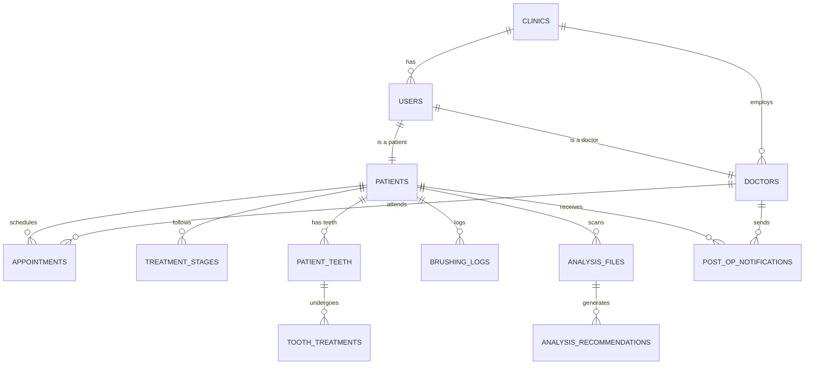

# T.C. ÜNİVERSİTESİ
## BİLGİSAYAR MÜHENDİSLİĞİ BÖLÜMÜ
### VERİTABANI YÖNETİM SİSTEMLERİ DERSİ FİNAL PROJESİ RAPORU

---

**Proje Adı:** DentsAI - Yapay Zeka Destekli Diş Kliniği Otomasyonu  
**Geliştirici:** Aslı AYDIN  
**Proje Rolü:** Full-Stack Developer & Veritabanı Mimarı  
**Tarih:** 29 Mayıs 2026  

---

## İÇİNDEKİLER
1. [ADIM-1: SENARYO VE İŞ KURALLARI](#adım-1-senaryo-ve-iş-kuralları)
    - 1.1. [SaaS ve Çok Kiracılı (Multi-Tenant) Mimari Yapısı](#11-saas-ve-çok-kiracılı-multi-tenant-mimari-yapısı)
    - 1.2. [Kullanıcı Rolleri ve Panel Entegrasyonları](#12-kullanıcı-rolleri-ve-panel-entegrasyonları)
    - 1.3. [Uçtan Uca Veri Akışı (Doktor & Hasta Paneli)](#13-uçtan-uca-veri-akışı-doktor--hasta-paneli)
    - 1.4. [İş Kuralları ve Veri Bütünlüğü Kısıtları (Constraints)](#14-iş-kuralları-ve-veri-bütünlüğü-kısıtları-constraints)
2. [ADIM-2: VARLIKLAR, NİTELİKLER VE İLİŞKİLER (ERD)](#adım-2-varlıklar-nitelikler-ve-ilişkiler-erd)
    - 2.1. [Varlık Tanımları ve Nitelik Detayları](#21-varlık-tanımları-ve-nitelik-detayları)
    - 2.2. [İlişkisel (Mantıksal) Şema Gösterimi](#22-ilişkisel-mantıksal-şema-gösterimi)
    - 2.3. [Varlık-İlişki (Entity-Relationship) Diyagramı - Mermaid](#23-varlık-ilişki-entity-relationship-diyagramı---mermaid)
3. [ADIM-3: FİZİKSEL TASARIM (DDL & SQL KODLARI)](#adım-3-fiziksel-tasarım-ddl--sql-kodları)
    - 3.1. [MySQL Tablo DDL Kodları (CREATE TABLE)](#31-mysql-tablo-ddl-kodları-create-table)
    - 3.2. [Kayıtlı Yordamlar (Stored Procedures - CRUD)](#32-kayıtlı-yordamlar-stored-procedures---crud)
    - 3.3. [Kullanıcı Tanımlı Fonksiyonlar (User Defined Functions - UDF)](#33-kullanıcı-tanımlı-fonksiyonlar-user-defined-functions---udf)
    - 3.4. [Veritabanı Tetikleyicileri (Triggers)](#34-veritabanı-tetikleyicileri-triggers)

---

## ADIM-1: SENARYO VE İŞ KURALLARI

### 1.1. SaaS ve Çok Kiracılı (Multi-Tenant) Mimari Yapısı
**DentsAI**, çok kiracılı (multi-tenant) yazılım mimarisini (SaaS) benimsemiş, bulut tabanlı modern bir diş hekimliği ve ağız sağlığı otomasyon platformudur. Sistemde her bir diş kliniği ayrı bir **kiracı (tenant)** olarak tanımlanır. 

*   **Tenant İzolasyonu:** Kliniğe ait tüm operasyonel kısıtlar, üyelik paketleri ve sınırlar `clinics` tablosunda saklanır. Sistemdeki kullanıcılar (`users`), hekimler (`doctors`) ve dolaylı olarak tüm tıbbi veriler `clinic_id` yabancı anahtarı (foreign key) ile izole edilir.
*   **SaaS Paket Yönetimi:** Her kliniğin satın aldığı pakete (`Standard`, `Professional`, `Enterprise`) göre hekim sınırı (`doctor_limit`), depolama sınırı (`storage_limit`) ve aylık yapay zeka röntgen tarama sınırı (`ai_scan_limit`) bulunur. Bu dinamik kısıtlar veritabanı seviyesinde takip edilir.

### 1.2. Kullanıcı Rolleri ve Panel Entegrasyonları
Sistem, `users` tablosu üzerinde tanımlı çoklu rol mimarisine sahiptir. Bu roller şunlardır:
*   **Super Admin:** Tüm SaaS altyapısını yöneten, klinik ekleyen ve global logları izleyen en üst düzey yetkili rol.
*   **Clinic Admin:** Kendi kliniğine ait hekim, sekreter ve hastaları yöneten, klinik profil ayarlarını düzenleyen idari rol.
*   **Doctor (Hekim):** Teşhis, tedavi ve röntgen analizi yapan tıbbi rol.
*   **Secretary (Sekreter):** Klinik randevularını, hasta kayıtlarını ve genel takvimi yöneten operasyonel rol.
*   **Patient (Hasta):** Kendi tedavi süreçlerini, diş fırçalama alışkanlıklarını ve röntgen analiz sonuçlarını takip eden portal kullanıcısı.

### 1.3. Uçtan Uca Veri Akışı (Doktor & Hasta Paneli)
Sistemde veri akışı doktorun teşhis koyması ile başlar ve hastanın portalında gerçek zamanlı yansıma bulur:
1.  **Muayene ve Teşhis:** Hekim, hekim paneli üzerinden hastaya ait interaktif **FDI Odontogramı (Diş Haritası)** üzerinde sorunlu dişi seçerek durumu 'risk' veya 'treatment' (tedaviye başlanacak) olarak günceller. Bu işlem `patient_teeth` tablosuna yansır.
2.  **Randevu ve İşlem Kaydı:** Tedavi edilecek hastaya bir randevu oluşturulur (`appointments`). Randevu günü hekim, 'İşlem Kaydı' sekmesinden tedavi türünü (örn: Estetik Kompozit Dolgu, Kanal Tedavisi vb.) girerek işlemi tamamlar.
3.  **Otomatik Durum Güncellemesi (Tetikleyici):** `tooth_treatments` tablosuna yeni bir kayıt girildiği anda, veritabanı tetikleyicisi (`trg_AfterToothTreatmentInsert`) devreye girer. İlgili dişin `patient_teeth` üzerindeki durumu otomatik olarak `'completed'` (tamamlandı) yapılır ve hekimin girdiği tedavi notları tarih bilgisiyle dişin geçmiş notlarına eklenir.
4.  **Hasta Portalı Yansıması:** Hasta, kendi paneline giriş yaptığında `patient_teeth` verilerinin güncel halini sadeleştirilmiş bir anatomi şemasında (renk kodlarıyla) izler. Ayrıca hastanın çene sağlık skoru, arka planda çalışan `fn_GetUnhealthyToothCount` fonksiyonu kullanılarak `((32 - sağlıksız_diş) / 32) * 100` formülüyle dinamik olarak hesaplanıp yansıtılır.
5.  **Hasta Etkileşimi ve Geri Bildirim:** Hasta, mobil/web arayüzünden diş fırçalama günlüğü (`brushing_logs`) girer. Bu veriler `fn_GetAverageBrushingScore` fonksiyonu ile işlenerek hekime hastanın ağız bakım disiplini hakkında grafiksel rapor sunar.

### 1.4. İş Kuralları ve Veri Bütünlüğü Kısıtları (Constraints)
Veritabanında veri tutarlılığını garanti altına almak amacıyla aşağıdaki katı kısıtlamalar (constraints) uygulanmıştır:
*   **Benzersiz E-posta Kısıtı (`UNIQUE`):** Her kullanıcının (`users.email`) sistem genelinde benzersiz olması zorunludur. Aynı e-posta adresi ile ikinci bir hesap açılamaz.
*   **Randevusuz İşlem Yapılamama Mantığı (Business Constraint):** Hekim paneli ve iş katmanında randevusu olmayan hastalara ait tıbbi müdahaleler engellenmektedir. Tedavi kayıtları (`tooth_treatments`) mutlaka geçerli bir hasta (`patients`) ve veritabanı bütünlüğü için ilişkili kayıtlar üzerinden yürütülür.
*   **FDI Diş Numarası Kontrolü (`CHECK`):** `patient_teeth` tablosundaki `tooth_num` alanı, uluslararası FDI standardına uygun olarak 11 ile 48 arasında olmalıdır (ara numaralar elenir). Bu kural `chk_tooth_num CHECK (tooth_num BETWEEN 11 AND 48)` kısıtı ile fiziksel olarak korunur.
*   **TC Kimlik No Bütünlüğü:** `patients.tc_no` sütunu tam olarak 11 karakterden oluşmakta ve sistem genelinde benzersiz (`UNIQUE`) tutulmaktadır.
*   **Diploma No Benzersizliği:** Hekimlerin sahte profiller oluşturmasını engellemek adına `doctors.diploma_no` alanı `UNIQUE` olarak işaretlenmiştir.
*   **Referans Bütünlüğü (`Foreign Key - CASCADE/SET NULL`):** Bir kullanıcı silindiğinde ona bağlı doktor (`doctors`) veya hasta (`patients`) profili `ON DELETE CASCADE` ile otomatik silinir. Ancak bir klinik silindiğinde, kullanıcıların doğrudan silinmemesi, bunun yerine klinik referanslarının boşa çıkması için `ON DELETE SET NULL` kuralı uygulanmıştır.

---

## ADIM-2: VARLIKLAR, NİTELİKLER VE İLİŞKİLER (ERD)

### 2.1. Varlık Tanımları ve Nitelik Detayları

#### 1. Klinikler (`clinics`)
*   `id` (VARCHAR(50), PK): Benzersiz klinik kodu.
*   `name` (VARCHAR(255), NOT NULL): Klinik adı.
*   `logo_url` (VARCHAR(255), NULL): Klinik logosu dosya yolu.
*   `theme_color` (VARCHAR(50), NULL): Arayüz tema renk kodu.
*   `status` (ENUM('active', 'passive'), NOT NULL): Klinik durumu.
*   `package_name` (ENUM('Standard', 'Professional', 'Enterprise'), NOT NULL): Üyelik paketi.
*   `doctor_limit` (INT, NOT NULL): Maksimum hekim limiti.
*   `storage_limit` (INT, NOT NULL): Maksimum depolama alanı (GB).
*   `ai_scan_limit` (INT, NOT NULL): Aylık maksimum yapay zeka röntgen analiz limiti.
*   `doctor_count` (INT, NOT NULL, DEFAULT 0): Mevcut aktif hekim sayısı.
*   `storage_used` (DECIMAL(10,2), NOT NULL, DEFAULT 0.00): Kullanılan depolama alanı.
*   `ai_scan_count` (INT, NOT NULL, DEFAULT 0): Bu ay yapılan AI analizi sayısı.
*   `phone` (VARCHAR(50), NULL): Klinik telefon numarası.
*   `admin_email` (VARCHAR(255), NULL): Klinik yöneticisi e-postası.
*   `temporary_password` (VARCHAR(255), NULL): Yöneticinin geçici şifresi.
*   `created_date` (DATE, NOT NULL): Kayıt tarihi.

#### 2. Kullanıcılar (`users`)
*   `id` (VARCHAR(50), PK): Benzersiz kullanıcı ID'si.
*   `email` (VARCHAR(255), UNIQUE, NOT NULL): Giriş e-postası.
*   `password` (VARCHAR(255), NOT NULL): Kriptolu giriş şifresi.
*   `name` (VARCHAR(255), NOT NULL): Ad soyad.
*   `role` (ENUM('super_admin', 'clinic_admin', 'doctor', 'secretary', 'patient'), NOT NULL): Sistem rolü.
*   `clinic_id` (VARCHAR(50), FK -> `clinics.id`, NULL): Bağlı olduğu klinik.
*   `is_temporary_password` (TINYINT(1), NOT NULL, DEFAULT 1): Geçici şifre aktifliği.
*   `phone_number` (VARCHAR(50), NULL): Telefon numarası.

#### 3. Doktorlar (`doctors`)
*   `user_id` (VARCHAR(50), PK, FK -> `users.id`): Kullanıcı referansı.
*   `diploma_no` (VARCHAR(100), UNIQUE, NOT NULL): Diploma tescil numarası.
*   `specialty` (VARCHAR(255), NULL): Uzmanlık dalı (Pedodonti, Ortodonti, vb.).
*   `education` (VARCHAR(255), NULL): Mezun olunan üniversite / eğitim bilgisi.
*   `bio` (TEXT, NULL): Hekim özgeçmişi.
*   `avatar_url` (VARCHAR(255), NULL): Profil resmi dosya yolu.
*   `clinic_id` (VARCHAR(50), FK -> `clinics.id`, NOT NULL): Çalıştığı klinik.

#### 4. Hastalar (`patients`)
*   `user_id` (VARCHAR(50), PK, FK -> `users.id`): Kullanıcı referansı.
*   `tc_no` (CHAR(11), UNIQUE, NOT NULL): T.C. Kimlik Numarası.
*   `gender` (ENUM('Erkek', 'Kadın'), NOT NULL): Cinsiyet.
*   `dob` (DATE, NOT NULL): Doğum tarihi.
*   `blood_type` (VARCHAR(10), NULL): Kan grubu.
*   `allergies` (TEXT, NULL): Kronik alerjiler ve ilaç hassasiyetleri.
*   `treatment_status` (ENUM('Tedavide', 'Teşhis Aşamasında', 'Tamamlandı'), NOT NULL): Genel tedavi durumu.
*   `avatar_url` (VARCHAR(255), NULL): Hasta profil resmi.
*   `recommended_treatment` (TEXT, NULL): Hekim tarafından önerilen tedavi yol haritası notu.
*   `primary_dentist_id` (VARCHAR(50), FK -> `doctors.user_id`, NULL): Sorumlu birincil hekim.

#### 5. Randevular (`appointments`)
*   `id` (VARCHAR(50), PK): Benzersiz randevu kodu.
*   `patient_id` (VARCHAR(50), FK -> `patients.user_id`, NOT NULL): Randevu sahibi hasta.
*   `doctor_id` (VARCHAR(50), FK -> `doctors.user_id`, NOT NULL): Randevu veren hekim.
*   `appointment_date` (DATE, NOT NULL): Randevu tarihi.
*   `appointment_time` (TIME, NOT NULL): Randevu saati.
*   `appointment_type` (VARCHAR(255), NOT NULL): Randevu türü / açıklama.
*   `status` (ENUM('Bekliyor', 'Tamamlandı', 'İptal Edildi'), NOT NULL): Randevu durumu.

#### 6. Tedavi Aşamaları (`treatment_stages`)
*   `id` (INT, AUTO_INCREMENT, PK): Otomatik artan aşama numarası.
*   `patient_id` (VARCHAR(50), FK -> `patients.user_id`, NOT NULL): İlgili hasta.
*   `title` (VARCHAR(255), NOT NULL): Aşama başlığı (örn: Üst Dolgular, Kanal Tedavisi).
*   `stage_date` (DATE, NOT NULL): Planlanan tarih.
*   `status` (ENUM('done', 'active', 'upcoming'), NOT NULL): Aşama durumu.
*   `notes` (TEXT, NULL): Aşamaya dair notlar.

#### 7. Hasta Diş Durumları (`patient_teeth`)
*   `patient_id` (VARCHAR(50), PK, FK -> `patients.user_id`): Hasta referansı.
*   `tooth_num` (INT, PK): FDI Standart Diş Numarası (11-48).
*   `name` (VARCHAR(100), NOT NULL): Dişin anatomik ismi (örn: Sağ Üst Santral Kesici).
*   `zone` (ENUM('upper-right', 'upper-left', 'lower-left', 'lower-right'), NOT NULL): Çene bölgesi.
*   `status` (ENUM('healthy', 'risk', 'treatment', 'completed'), NOT NULL): Dişin anlık durumu.
*   `notes` (TEXT, NULL): Diş üzerine eklenen hekim notları.
*   *Not: Bu tablo Composite PK (patient_id, tooth_num) yapısına sahiptir.*

#### 8. Diş Tedavi Detayları (`tooth_treatments`)
*   `id` (INT, AUTO_INCREMENT, PK): Otomatik artan tedavi işlem ID'si.
*   `patient_id` (VARCHAR(50), NOT NULL): Hasta ID.
*   `tooth_num` (INT, NOT NULL): Diş Numarası.
*   `treatment_type` (ENUM('none', 'dolgu', 'kanal', 'temizlik', 'cekme', 'muayene'), NOT NULL): Yapılan operasyon türü.
*   `treatment_date` (DATE, NOT NULL): Operasyon tarihi.
*   `description` (TEXT, NULL): Yapılan işlemin detaylı açıklaması.
*   *FK İlişkisi: (patient_id, tooth_num) referans verir -> patient_teeth(patient_id, tooth_num).*

#### 9. Fırçalama Günlükleri (`brushing_logs`)
*   `id` (INT, AUTO_INCREMENT, PK): Otomatik artan kayıt numarası.
*   `patient_id` (VARCHAR(50), FK -> `patients.user_id`, NOT NULL): Günlüğü giren hasta.
*   `log_date` (DATE, NOT NULL): Fırçalama tarihi.
*   `log_time` (TIME, NOT NULL): Fırçalama saati.
*   `duration_seconds` (INT, NOT NULL): Fırçalama süresi (saniye).
*   `completed` (TINYINT(1), NOT NULL, DEFAULT 1): Başarıyla tamamlandı mı?
*   `score` (INT, NOT NULL): Fırçalama kalitesi skoru (0-100).
*   `period` (ENUM('Sabah', 'Öğlen', 'Akşam', 'Gece'), NOT NULL): Fırçalama periyodu.
*   `floss_used` (TINYINT(1), NOT NULL, DEFAULT 0): Diş ipi kullanımı.
*   `tongue_brushed` (TINYINT(1), NOT NULL, DEFAULT 0): Dil temizliği yapıldı mı?

#### 10. Yapay Zeka Röntgen Analizleri (`analysis_files`)
*   `id` (VARCHAR(50), PK): Benzersiz analiz kodu.
*   `patient_id` (VARCHAR(50), FK -> `patients.user_id`, NOT NULL): Röntgen sahibi hasta.
*   `image_url` (VARCHAR(255), NOT NULL): Röntgen dosyası URL'si.
*   `analysis_date` (DATE, NOT NULL): Röntgen analiz tarihi.
*   `status` (ENUM('completed', 'processing'), NOT NULL): Analiz durumu.
*   `score` (INT, NOT NULL): Yapay zeka ağız sağlığı skoru (0-100).
*   `plaque_index` (DECIMAL(5,2), NOT NULL): Plak yüzdesi.
*   `cavities_count` (INT, NOT NULL, DEFAULT 0): Saptanan çürük sayısı.

#### 11. Yapay Zeka Önerileri (`analysis_recommendations`)
*   `id` (INT, AUTO_INCREMENT, PK): Öneri işlem numarası.
*   `analysis_id` (VARCHAR(50), FK -> `analysis_files.id`, NOT NULL): Analiz referansı.
*   `recommendation` (TEXT, NOT NULL): Yapay zekanın ürettiği metin önerisi.

#### 12. Ameliyat / Tedavi Sonrası Bildirimler (`post_op_notifications`)
*   `id` (VARCHAR(50), PK): Bildirim benzersiz kodu.
*   `patient_id` (VARCHAR(50), FK -> `patients.user_id`, NOT NULL): Bildirimi alan hasta.
*   `title` (VARCHAR(255), NOT NULL): Bildirim başlığı.
*   `message` (TEXT, NOT NULL): Ameliyat sonrası bakım talimatı metni.
*   `notification_date` (DATETIME, NOT NULL): Gönderim tarihi.
*   `sent_by_doctor_id` (VARCHAR(50), FK -> `doctors.user_id`, NOT NULL): Gönderen hekim.
*   `status` (ENUM('Gönderildi', 'Okundu'), NOT NULL): Okunma durumu.

#### 13. Sistem Günlük Kayıtları (`system_logs`)
*   `id` (INT, AUTO_INCREMENT, PK): Log ID.
*   `log_time` (TIMESTAMP, DEFAULT CURRENT_TIMESTAMP): Log zamanı.
*   `layer` (ENUM('Presentation (UI)', 'Business Logic (BLL)', 'Data Access (DAL)', 'Stored Procedure (SP)'), NOT NULL): Loglanan mimari katman.
*   `command` (VARCHAR(255), NOT NULL): Çalıştırılan fonksiyon/komut/SP adı.
*   `details` (TEXT, NULL): Log detayları veya hata mesajları.

---

### 2.2. İlişkisel (Mantıksal) Şema Gösterimi
Aşağıda veritabanı şemasının ilişkisel veri modeli (relational logical schema) formatındaki gösterimi yer almaktadır:

*   **clinics** = {<u>id</u>, name, logo_url, theme_color, status, package_name, doctor_limit, storage_limit, ai_scan_limit, doctor_count, storage_used, ai_scan_count, phone, admin_email, temporary_password, created_date}
*   **users** = {<u>id</u>, email, password, name, role, *clinic_id (FK -> clinics.id)*, is_temporary_password, phone_number}
*   **doctors** = {<u>*user_id (PK, FK -> users.id)*</u>, diploma_no, specialty, education, bio, avatar_url, *clinic_id (FK -> clinics.id)*}
*   **patients** = {<u>*user_id (PK, FK -> users.id)*</u>, tc_no, gender, dob, blood_type, allergies, treatment_status, avatar_url, recommended_treatment, *primary_dentist_id (FK -> doctors.user_id)*}
*   **appointments** = {<u>id</u>, *patient_id (FK -> patients.user_id)*, *doctor_id (FK -> doctors.user_id)*, appointment_date, appointment_time, appointment_type, status}
*   **treatment_stages** = {<u>id</u>, *patient_id (FK -> patients.user_id)*, title, stage_date, status, notes}
*   **patient_teeth** = {<u>*patient_id (PK, FK -> patients.user_id)*, tooth_num</u>, name, zone, status, notes}
*   **tooth_treatments** = {<u>id</u>, *(patient_id, tooth_num) (FK -> patient_teeth(patient_id, tooth_num))*, treatment_type, treatment_date, description}
*   **brushing_logs** = {<u>id</u>, *patient_id (FK -> patients.user_id)*, log_date, log_time, duration_seconds, completed, score, period, floss_used, tongue_brushed}
*   **analysis_files** = {<u>id</u>, *patient_id (FK -> patients.user_id)*, image_url, analysis_date, status, score, plaque_index, cavities_count}
*   **analysis_recommendations** = {<u>id</u>, *analysis_id (FK -> analysis_files.id)*, recommendation}
*   **post_op_notifications** = {<u>id</u>, *patient_id (FK -> patients.user_id)*, title, message, notification_date, *sent_by_doctor_id (FK -> doctors.user_id)*, status}
*   **system_logs** = {<u>id</u>, log_time, layer, command, details}

---

### 2.3. Varlık-İlişki (Entity-Relationship) Diyagramı - Mermaid
Aşağıdaki kod bloğu veritabanının tüm ilişkilerini yansıtan Mermaid ERD kodudur. Standart Markdown derleyicileri ve diagrams.net (Draw.io) üzerinde doğrudan çalıştırılabilir:



---

## ADIM-3: FİZİKSEL TASARIM (DDL & SQL KODLARI)

### 3.1. MySQL Tablo DDL Kodları (CREATE TABLE)
FDI Diş Numarası kontrol kısıtları (`CHECK`), kaskad silme kuralları (`ON DELETE CASCADE`), veri bütünlüğü ve motor yapılandırması (InnoDB) ile birlikte tam DDL kodları aşağıdadır:

```sql
CREATE DATABASE IF NOT EXISTS dental_clinic_db;
USE dental_clinic_db;

-- 1. KLİNİKLER TABLOSU
CREATE TABLE clinics (
    id VARCHAR(50) PRIMARY KEY,
    name VARCHAR(255) NOT NULL,
    logo_url VARCHAR(255) NULL,
    theme_color VARCHAR(50) NULL,
    status ENUM('active', 'passive') NOT NULL DEFAULT 'passive',
    package_name ENUM('Standard', 'Professional', 'Enterprise') NOT NULL,
    doctor_limit INT NOT NULL,
    storage_limit INT NOT NULL COMMENT 'Limit in GB',
    ai_scan_limit INT NOT NULL,
    doctor_count INT NOT NULL DEFAULT 0,
    storage_used DECIMAL(10,2) NOT NULL DEFAULT 0.00 COMMENT 'Used storage in GB',
    ai_scan_count INT NOT NULL DEFAULT 0,
    phone VARCHAR(50) NULL,
    admin_email VARCHAR(255) NULL,
    temporary_password VARCHAR(255) NULL,
    created_date DATE NOT NULL
) ENGINE=InnoDB DEFAULT CHARSET=utf8mb4 COLLATE=utf8mb4_unicode_ci;

-- 2. KULLANICILAR TABLOSU
CREATE TABLE users (
    id VARCHAR(50) PRIMARY KEY,
    email VARCHAR(255) NOT NULL UNIQUE,
    password VARCHAR(255) NOT NULL,
    name VARCHAR(255) NOT NULL,
    role ENUM('super_admin', 'clinic_admin', 'doctor', 'secretary', 'patient') NOT NULL,
    clinic_id VARCHAR(50) NULL,
    is_temporary_password TINYINT(1) NOT NULL DEFAULT 1,
    phone_number VARCHAR(50) NULL,
    FOREIGN KEY (clinic_id) REFERENCES clinics(id) ON DELETE SET NULL
) ENGINE=InnoDB DEFAULT CHARSET=utf8mb4 COLLATE=utf8mb4_unicode_ci;

-- 3. DOKTORLAR TABLOSU
CREATE TABLE doctors (
    user_id VARCHAR(50) PRIMARY KEY,
    diploma_no VARCHAR(100) NOT NULL UNIQUE,
    specialty VARCHAR(255) NULL,
    education VARCHAR(255) NULL,
    bio TEXT NULL,
    avatar_url VARCHAR(255) NULL,
    clinic_id VARCHAR(50) NOT NULL,
    FOREIGN KEY (user_id) REFERENCES users(id) ON DELETE CASCADE,
    FOREIGN KEY (clinic_id) REFERENCES clinics(id) ON DELETE CASCADE
) ENGINE=InnoDB DEFAULT CHARSET=utf8mb4 COLLATE=utf8mb4_unicode_ci;

-- 4. HASTALAR TABLOSU
CREATE TABLE patients (
    user_id VARCHAR(50) PRIMARY KEY,
    tc_no CHAR(11) NOT NULL UNIQUE,
    gender ENUM('Erkek', 'Kadın') NOT NULL,
    dob DATE NOT NULL,
    blood_type VARCHAR(10) NULL,
    allergies TEXT NULL,
    treatment_status ENUM('Tedavide', 'Teşhis Aşamasında', 'Tamamlandı') NOT NULL DEFAULT 'Teşhis Aşamasında',
    avatar_url VARCHAR(255) NULL,
    recommended_treatment TEXT NULL,
    primary_dentist_id VARCHAR(50) NULL,
    FOREIGN KEY (user_id) REFERENCES users(id) ON DELETE CASCADE,
    FOREIGN KEY (primary_dentist_id) REFERENCES doctors(user_id) ON DELETE SET NULL
) ENGINE=InnoDB DEFAULT CHARSET=utf8mb4 COLLATE=utf8mb4_unicode_ci;

-- 5. RANDEVULAR TABLOSU
CREATE TABLE appointments (
    id VARCHAR(50) PRIMARY KEY,
    patient_id VARCHAR(50) NOT NULL,
    doctor_id VARCHAR(50) NOT NULL,
    appointment_date DATE NOT NULL,
    appointment_time TIME NOT NULL,
    appointment_type VARCHAR(255) NOT NULL,
    status ENUM('Bekliyor', 'Tamamlandı', 'İptal Edildi') NOT NULL DEFAULT 'Bekliyor',
    FOREIGN KEY (patient_id) REFERENCES patients(user_id) ON DELETE CASCADE,
    FOREIGN KEY (doctor_id) REFERENCES doctors(user_id) ON DELETE CASCADE
) ENGINE=InnoDB DEFAULT CHARSET=utf8mb4 COLLATE=utf8mb4_unicode_ci;

-- 6. TEDAVİ AŞAMALARI TABLOSU
CREATE TABLE treatment_stages (
    id INT AUTO_INCREMENT PRIMARY KEY,
    patient_id VARCHAR(50) NOT NULL,
    title VARCHAR(255) NOT NULL,
    stage_date DATE NOT NULL,
    status ENUM('done', 'active', 'upcoming') NOT NULL DEFAULT 'upcoming',
    notes TEXT NULL,
    FOREIGN KEY (patient_id) REFERENCES patients(user_id) ON DELETE CASCADE
) ENGINE=InnoDB DEFAULT CHARSET=utf8mb4 COLLATE=utf8mb4_unicode_ci;

-- 7. HASTA DİŞ DURUMLARI TABLOSU
CREATE TABLE patient_teeth (
    patient_id VARCHAR(50) NOT NULL,
    tooth_num INT NOT NULL COMMENT 'FDI Tooth Numbering System (11-48)',
    name VARCHAR(100) NOT NULL,
    zone ENUM('upper-right', 'upper-left', 'lower-left', 'lower-right') NOT NULL,
    status ENUM('healthy', 'risk', 'treatment', 'completed') NOT NULL DEFAULT 'healthy',
    notes TEXT NULL,
    PRIMARY KEY (patient_id, tooth_num),
    FOREIGN KEY (patient_id) REFERENCES patients(user_id) ON DELETE CASCADE,
    CONSTRAINT chk_tooth_num CHECK (tooth_num BETWEEN 11 AND 48)
) ENGINE=InnoDB DEFAULT CHARSET=utf8mb4 COLLATE=utf8mb4_unicode_ci;

-- 8. DİŞ TEDAVİ DETAYLARI TABLOSU
CREATE TABLE tooth_treatments (
    id INT AUTO_INCREMENT PRIMARY KEY,
    patient_id VARCHAR(50) NOT NULL,
    tooth_num INT NOT NULL,
    treatment_type ENUM('none', 'dolgu', 'kanal', 'temizlik', 'cekme', 'muayene') NOT NULL,
    treatment_date DATE NOT NULL,
    description TEXT NULL,
    FOREIGN KEY (patient_id, tooth_num) REFERENCES patient_teeth(patient_id, tooth_num) ON DELETE CASCADE
) ENGINE=InnoDB DEFAULT CHARSET=utf8mb4 COLLATE=utf8mb4_unicode_ci;

-- 9. FIRÇALAMA GÜNLÜKLERİ TABLOSU
CREATE TABLE brushing_logs (
    id INT AUTO_INCREMENT PRIMARY KEY,
    patient_id VARCHAR(50) NOT NULL,
    log_date DATE NOT NULL,
    log_time TIME NOT NULL,
    duration_seconds INT NOT NULL,
    completed TINYINT(1) NOT NULL DEFAULT 1,
    score INT NOT NULL,
    period ENUM('Sabah', 'Öğlen', 'Akşam', 'Gece') NOT NULL DEFAULT 'Sabah',
    floss_used TINYINT(1) NOT NULL DEFAULT 0,
    tongue_brushed TINYINT(1) NOT NULL DEFAULT 0,
    FOREIGN KEY (patient_id) REFERENCES patients(user_id) ON DELETE CASCADE
) ENGINE=InnoDB DEFAULT CHARSET=utf8mb4 COLLATE=utf8mb4_unicode_ci;

-- 10. YAPAY ZEKA RÖNTGEN ANALİZLERİ TABLOSU
CREATE TABLE analysis_files (
    id VARCHAR(50) PRIMARY KEY,
    patient_id VARCHAR(50) NOT NULL,
    image_url VARCHAR(255) NOT NULL,
    analysis_date DATE NOT NULL,
    status ENUM('completed', 'processing') NOT NULL DEFAULT 'processing',
    score INT NOT NULL,
    plaque_index DECIMAL(5,2) NOT NULL COMMENT 'Plak yüzdesi',
    cavities_count INT NOT NULL DEFAULT 0,
    FOREIGN KEY (patient_id) REFERENCES patients(user_id) ON DELETE CASCADE
) ENGINE=InnoDB DEFAULT CHARSET=utf8mb4 COLLATE=utf8mb4_unicode_ci;

-- 11. YAPAY ZEKA ÖNERİLERİ TABLOSU
CREATE TABLE analysis_recommendations (
    id INT AUTO_INCREMENT PRIMARY KEY,
    analysis_id VARCHAR(50) NOT NULL,
    recommendation TEXT NOT NULL,
    FOREIGN KEY (analysis_id) REFERENCES analysis_files(id) ON DELETE CASCADE
) ENGINE=InnoDB DEFAULT CHARSET=utf8mb4 COLLATE=utf8mb4_unicode_ci;

-- 12. AMELİYAT / TEDAVİ SONRASI BİLDİRİMLER
CREATE TABLE post_op_notifications (
    id VARCHAR(50) PRIMARY KEY,
    patient_id VARCHAR(50) NOT NULL,
    title VARCHAR(255) NOT NULL,
    message TEXT NOT NULL,
    notification_date DATETIME NOT NULL,
    sent_by_doctor_id VARCHAR(50) NOT NULL,
    status ENUM('Gönderildi', 'Okundu') NOT NULL DEFAULT 'Gönderildi',
    FOREIGN KEY (patient_id) REFERENCES patients(user_id) ON DELETE CASCADE,
    FOREIGN KEY (sent_by_doctor_id) REFERENCES doctors(user_id) ON DELETE CASCADE
) ENGINE=InnoDB DEFAULT CHARSET=utf8mb4 COLLATE=utf8mb4_unicode_ci;

-- 13. SİSTEM GÜNLÜK KAYITLARI TABLOSU
CREATE TABLE system_logs (
    id INT AUTO_INCREMENT PRIMARY KEY,
    log_time TIMESTAMP DEFAULT CURRENT_TIMESTAMP,
    layer ENUM('Presentation (UI)', 'Business Logic (BLL)', 'Data Access (DAL)', 'Stored Procedure (SP)') NOT NULL,
    command VARCHAR(255) NOT NULL,
    details TEXT NULL
) ENGINE=InnoDB DEFAULT CHARSET=utf8mb4 COLLATE=utf8mb4_unicode_ci;
```

---

### 3.2. Kayıtlı Yordamlar (Stored Procedures - CRUD)
Projenin N-Katmanlı Mimari standartları gereği veri erişim katmanında (DAL) doğrudan inline sorgular yerine Stored Procedure kullanımı zorunludur. Özellikle `Patients`, `Appointments`, `Tooth_Treatments` ve `Brushing_Logs` tablolarına ait CRUD yordam kodları aşağıda listelenmiştir:

#### 3.2.1. Hastalar (Patients) CRUD Stored Procedures
```sql
DELIMITER $$

-- Ekleme (Insert)
DROP PROCEDURE IF EXISTS sp_InsertPatient$$
CREATE PROCEDURE sp_InsertPatient(
    IN p_user_id VARCHAR(50), IN p_tc_no CHAR(11), IN p_gender ENUM('Erkek', 'Kadın'),
    IN p_dob DATE, IN p_blood_type VARCHAR(10), IN p_allergies TEXT,
    IN p_treatment_status ENUM('Tedavide', 'Teşhis Aşamasında', 'Tamamlandı'),
    IN p_avatar_url VARCHAR(255), IN p_recommended_treatment TEXT, IN p_primary_dentist_id VARCHAR(50)
)
BEGIN
    INSERT INTO patients (user_id, tc_no, gender, dob, blood_type, allergies, treatment_status, avatar_url, recommended_treatment, primary_dentist_id)
    VALUES (p_user_id, p_tc_no, p_gender, p_dob, p_blood_type, p_allergies, p_treatment_status, p_avatar_url, p_recommended_treatment, p_primary_dentist_id);
END$$

-- Güncelleme (Update)
DROP PROCEDURE IF EXISTS sp_UpdatePatient$$
CREATE PROCEDURE sp_UpdatePatient(
    IN p_user_id VARCHAR(50), IN p_tc_no CHAR(11), IN p_gender ENUM('Erkek', 'Kadın'),
    IN p_dob DATE, IN p_blood_type VARCHAR(10), IN p_allergies TEXT,
    IN p_treatment_status ENUM('Tedavide', 'Teşhis Aşamasında', 'Tamamlandı'),
    IN p_avatar_url VARCHAR(255), IN p_recommended_treatment TEXT, IN p_primary_dentist_id VARCHAR(50)
)
BEGIN
    UPDATE patients 
    SET tc_no = p_tc_no, gender = p_gender, dob = p_dob, blood_type = p_blood_type, 
        allergies = p_allergies, treatment_status = p_treatment_status, avatar_url = p_avatar_url, 
        recommended_treatment = p_recommended_treatment, primary_dentist_id = p_primary_dentist_id
    WHERE user_id = p_user_id;
END$$

-- Silme (Delete)
DROP PROCEDURE IF EXISTS sp_DeletePatient$$
CREATE PROCEDURE sp_DeletePatient(IN p_user_id VARCHAR(50))
BEGIN
    DELETE FROM patients WHERE user_id = p_user_id;
END$$

-- Listeleme (Select - Detaylı ve Join'li)
DROP PROCEDURE IF EXISTS sp_GetPatient$$
CREATE PROCEDURE sp_GetPatient(
    IN p_user_id VARCHAR(50) CHARACTER SET utf8mb4 COLLATE utf8mb4_unicode_ci,
    IN p_clinic_id VARCHAR(50) CHARACTER SET utf8mb4 COLLATE utf8mb4_unicode_ci,
    IN p_doctor_id VARCHAR(50) CHARACTER SET utf8mb4 COLLATE utf8mb4_unicode_ci
)
BEGIN
    SELECT p.*, u.name, u.email, u.phone_number, doc_u.name AS primary_dentist_name
    FROM patients p
    JOIN users u ON p.user_id = u.id
    LEFT JOIN users doc_u ON p.primary_dentist_id = doc_u.id
    WHERE (p_user_id IS NULL OR p_user_id = '' OR p.user_id = p_user_id)
      AND (p_clinic_id IS NULL OR p_clinic_id = '' OR u.clinic_id = p_clinic_id)
      AND (p_doctor_id IS NULL OR p_doctor_id = '' OR p.primary_dentist_id = p_doctor_id);
END$$

DELIMITER ;
```

#### 3.2.2. Randevular (Appointments) CRUD Stored Procedures
```sql
DELIMITER $$

-- Ekleme (Insert)
DROP PROCEDURE IF EXISTS sp_InsertAppointment$$
CREATE PROCEDURE sp_InsertAppointment(
    IN p_id VARCHAR(50), IN p_patient_id VARCHAR(50), IN p_doctor_id VARCHAR(50),
    IN p_appointment_date DATE, IN p_appointment_time TIME, IN p_appointment_type VARCHAR(255),
    IN p_status ENUM('Bekliyor', 'Tamamlandı', 'İptal Edildi')
)
BEGIN
    INSERT INTO appointments (id, patient_id, doctor_id, appointment_date, appointment_time, appointment_type, status)
    VALUES (p_id, p_patient_id, p_doctor_id, p_appointment_date, p_appointment_time, p_appointment_type, p_status);
END$$

-- Güncelleme (Update)
DROP PROCEDURE IF EXISTS sp_UpdateAppointment$$
CREATE PROCEDURE sp_UpdateAppointment(
    IN p_id VARCHAR(50), IN p_patient_id VARCHAR(50), IN p_doctor_id VARCHAR(50),
    IN p_appointment_date DATE, IN p_appointment_time TIME, IN p_appointment_type VARCHAR(255),
    IN p_status ENUM('Bekliyor', 'Tamamlandı', 'İptal Edildi')
)
BEGIN
    UPDATE appointments 
    SET patient_id = p_patient_id, doctor_id = p_doctor_id, appointment_date = p_appointment_date, 
        appointment_time = p_appointment_time, appointment_type = p_appointment_type, status = p_status
    WHERE id = p_id;
END$$

-- Silme (Delete)
DROP PROCEDURE IF EXISTS sp_DeleteAppointment$$
CREATE PROCEDURE sp_DeleteAppointment(IN p_id VARCHAR(50) CHARACTER SET utf8mb4 COLLATE utf8mb4_unicode_ci)
BEGIN
    DELETE FROM appointments WHERE id = p_id;
END$$

-- Listeleme (Select)
DROP PROCEDURE IF EXISTS sp_GetAppointment$$
CREATE PROCEDURE sp_GetAppointment(IN p_id VARCHAR(50) CHARACTER SET utf8mb4 COLLATE utf8mb4_unicode_ci)
BEGIN
    IF p_id IS NULL OR p_id = '' THEN
        SELECT a.*, u_pat.name AS patient_name, u_doc.name AS doctor_name
        FROM appointments a
        JOIN patients p ON a.patient_id = p.user_id
        JOIN users u_pat ON p.user_id = u_pat.id
        JOIN doctors d ON a.doctor_id = d.user_id
        JOIN users u_doc ON d.user_id = u_doc.id
        ORDER BY a.appointment_date DESC, a.appointment_time DESC;
    ELSE
        SELECT a.*, u_pat.name AS patient_name, u_doc.name AS doctor_name
        FROM appointments a
        JOIN patients p ON a.patient_id = p.user_id
        JOIN users u_pat ON p.user_id = u_pat.id
        JOIN doctors d ON a.doctor_id = d.user_id
        JOIN users u_doc ON d.user_id = u_doc.id
        WHERE a.id = p_id;
    END IF;
END$$

DELIMITER ;
```

#### 3.2.3. Diş Tedavileri (Tooth Treatments) CRUD Stored Procedures
```sql
DELIMITER $$

-- Ekleme (Insert)
DROP PROCEDURE IF EXISTS sp_InsertToothTreatment$$
CREATE PROCEDURE sp_InsertToothTreatment(
    IN p_patient_id VARCHAR(50) CHARACTER SET utf8mb4 COLLATE utf8mb4_unicode_ci, IN p_tooth_num INT,
    IN p_treatment_type VARCHAR(255) CHARACTER SET utf8mb4 COLLATE utf8mb4_unicode_ci,
    IN p_treatment_date DATE, IN p_description TEXT
)
BEGIN
    INSERT INTO tooth_treatments (patient_id, tooth_num, treatment_type, treatment_date, description)
    VALUES (p_patient_id, p_tooth_num, p_treatment_type, p_treatment_date, p_description);
END$$

-- Güncelleme (Update)
DROP PROCEDURE IF EXISTS sp_UpdateToothTreatment$$
CREATE PROCEDURE sp_UpdateToothTreatment(
    IN p_id INT, IN p_patient_id VARCHAR(50) CHARACTER SET utf8mb4 COLLATE utf8mb4_unicode_ci, IN p_tooth_num INT,
    IN p_treatment_type VARCHAR(255) CHARACTER SET utf8mb4 COLLATE utf8mb4_unicode_ci,
    IN p_treatment_date DATE, IN p_description TEXT
)
BEGIN
    UPDATE tooth_treatments 
    SET patient_id = p_patient_id, tooth_num = p_tooth_num, treatment_type = p_treatment_type, 
        treatment_date = p_treatment_date, description = p_description
    WHERE id = p_id;
END$$

-- Silme (Delete)
DROP PROCEDURE IF EXISTS sp_DeleteToothTreatment$$
CREATE PROCEDURE sp_DeleteToothTreatment(IN p_id INT)
BEGIN
    DELETE FROM tooth_treatments WHERE id = p_id;
END$$

-- Listeleme (Select)
DROP PROCEDURE IF EXISTS sp_GetToothTreatment$$
CREATE PROCEDURE sp_GetToothTreatment(
    IN p_id INT, 
    IN p_patient_id VARCHAR(50) CHARACTER SET utf8mb4 COLLATE utf8mb4_unicode_ci, 
    IN p_tooth_num INT
)
BEGIN
    IF p_id IS NOT NULL AND p_id > 0 THEN
        SELECT * FROM tooth_treatments WHERE id = p_id;
    ELSEIF p_patient_id IS NOT NULL AND p_patient_id <> '' AND p_tooth_num IS NOT NULL AND p_tooth_num > 0 THEN
        SELECT * FROM tooth_treatments WHERE patient_id = p_patient_id AND tooth_num = p_tooth_num ORDER BY treatment_date DESC;
    ELSEIF p_patient_id IS NOT NULL AND p_patient_id <> '' THEN
        SELECT * FROM tooth_treatments WHERE patient_id = p_patient_id ORDER BY treatment_date DESC;
    ELSE
        SELECT * FROM tooth_treatments;
    END IF;
END$$

DELIMITER ;
```

#### 3.2.4. Diş Fırçalama Günlükleri (Brushing Logs) CRUD Stored Procedures
```sql
DELIMITER $$

-- Ekleme (Insert)
DROP PROCEDURE IF EXISTS sp_InsertBrushingLog$$
CREATE PROCEDURE sp_InsertBrushingLog(
    IN p_patient_id VARCHAR(50), IN p_log_date DATE, IN p_log_time TIME,
    IN p_duration_seconds INT, IN p_completed TINYINT(1), IN p_score INT,
    IN p_period ENUM('Sabah', 'Öğlen', 'Akşam', 'Gece'), IN p_floss_used TINYINT(1), IN p_tongue_brushed TINYINT(1)
)
BEGIN
    INSERT INTO brushing_logs (patient_id, log_date, log_time, duration_seconds, completed, score, period, floss_used, tongue_brushed)
    VALUES (p_patient_id, p_log_date, p_log_time, p_duration_seconds, p_completed, p_score, p_period, p_floss_used, p_tongue_brushed);
END$$

-- Güncelleme (Update)
DROP PROCEDURE IF EXISTS sp_UpdateBrushingLog$$
CREATE PROCEDURE sp_UpdateBrushingLog(
    IN p_id INT, IN p_patient_id VARCHAR(50), IN p_log_date DATE, IN p_log_time TIME,
    IN p_duration_seconds INT, IN p_completed TINYINT(1), IN p_score INT,
    IN p_period ENUM('Sabah', 'Öğlen', 'Akşam', 'Gece'), IN p_floss_used TINYINT(1), IN p_tongue_brushed TINYINT(1)
)
BEGIN
    UPDATE brushing_logs 
    SET patient_id = p_patient_id, log_date = p_log_date, log_time = p_log_time, 
        duration_seconds = p_duration_seconds, completed = p_completed, score = p_score, 
        period = p_period, floss_used = p_floss_used, tongue_brushed = p_tongue_brushed
    WHERE id = p_id;
END$$

-- Silme (Delete)
DROP PROCEDURE IF EXISTS sp_DeleteBrushingLog$$
CREATE PROCEDURE sp_DeleteBrushingLog(IN p_id INT)
BEGIN
    DELETE FROM brushing_logs WHERE id = p_id;
END$$

-- Listeleme (Select)
DROP PROCEDURE IF EXISTS sp_GetBrushingLog$$
CREATE PROCEDURE sp_GetBrushingLog(IN p_id INT, IN p_patient_id VARCHAR(50))
BEGIN
    IF p_id IS NOT NULL AND p_id > 0 THEN
        SELECT * FROM brushing_logs WHERE id = p_id;
    ELSEIF p_patient_id IS NOT NULL AND p_patient_id <> '' THEN
        SELECT * FROM brushing_logs WHERE patient_id = p_patient_id ORDER BY log_date DESC, log_time DESC;
    ELSE
        SELECT * FROM brushing_logs;
    END IF;
END$$

DELIMITER ;
```

---

### 3.3. Kullanıcı Tanımlı Fonksiyonlar (User Defined Functions - UDF)
Sistem genelinde performans kazanmak ve iş mantığını doğrudan SQL motoru üzerinde işlemek için geliştirilen kullanıcı tanımlı fonksiyonların (UDF) kodları aşağıdadır:

#### 3.3.1. fn_GetUnhealthyToothCount
Hastanın 'risk' veya 'treatment' statüsündeki (sağlıksız) toplam diş sayısını hesaplar. Bu fonksiyon, hasta portalındaki Çene Sağlık Skoru hesaplanırken anlık olarak çağrılır.
```sql
DELIMITER $$

DROP FUNCTION IF EXISTS fn_GetUnhealthyToothCount$$
CREATE FUNCTION fn_GetUnhealthyToothCount(
    p_patient_id VARCHAR(50) CHARACTER SET utf8mb4 COLLATE utf8mb4_unicode_ci
)
RETURNS INT
DETERMINISTIC
READS SQL DATA
BEGIN
    DECLARE v_count INT;
    SELECT COUNT(*) INTO v_count
    FROM patient_teeth
    WHERE patient_id = p_patient_id AND status IN ('risk', 'treatment');
    RETURN IFNULL(v_count, 0);
END$$

DELIMITER ;
```

#### 3.3.2. fn_GetAverageBrushingScore
Hastanın veritabanında kayıtlı olan tüm fırçalama seanslarının kalitesini temsil eden ortalama fırçalama performans skorunu (0.00 - 100.00 arası) hesaplar.
```sql
DELIMITER $$

DROP FUNCTION IF EXISTS fn_GetAverageBrushingScore$$
CREATE FUNCTION fn_GetAverageBrushingScore(
    p_patient_id VARCHAR(50) CHARACTER SET utf8mb4 COLLATE utf8mb4_unicode_ci
)
RETURNS DECIMAL(5,2)
DETERMINISTIC
READS SQL DATA
BEGIN
    DECLARE v_avg_score DECIMAL(5,2);
    SELECT AVG(score) INTO v_avg_score
    FROM brushing_logs
    WHERE patient_id = p_patient_id;
    RETURN IFNULL(v_avg_score, 0.00);
END$$

DELIMITER ;
```

---

### 3.4. Veritabanı Tetikleyicileri (Triggers)
Klinik iş kurallarının otomatik uygulanmasını ve sistem genelinde olay takibini (event tracking) sağlamak amacıyla yapılandırılan tetikleyiciler (triggers) aşağıdadır:

#### 3.4.1. trg_AfterAppointmentUpdate
Randevu durumu ('Bekliyor', 'Tamamlandı', 'İptal Edildi') her değiştiğinde, sistem yöneticilerinin izlemesi ve denetim (audit) logu oluşturulması amacıyla `system_logs` tablosuna otomatik olarak işlem detaylarını kaydeder.
```sql
DELIMITER $$

DROP TRIGGER IF EXISTS trg_AfterAppointmentUpdate$$
CREATE TRIGGER trg_AfterAppointmentUpdate
AFTER UPDATE ON appointments
FOR EACH ROW
BEGIN
    IF OLD.status <> NEW.status THEN
        INSERT INTO system_logs (layer, command, details)
        VALUES (
            'Business Logic (BLL)',
            'trg_AfterAppointmentUpdate',
            CONCAT('Randevu (ID: ', NEW.id, ') durumu güncellendi. Eski: "', OLD.status, '", Yeni: "', NEW.status, '". Hasta: ', NEW.patient_id)
        );
    END IF;
END$$

DELIMITER ;
```

#### 3.4.2. trg_AfterToothTreatmentInsert
Yeni bir diş tedavisi (dolgu, kanal, temizlik, çekme) sisteme girildiği anda, ilgili dişin hasta diş kartındaki durumunu otomatik olarak `'completed'` (tamamlandı) yapar ve hekimin notunu tarihle zenginleştirerek günceller. Ayrıca bu işlem hakkında `system_logs` tablosuna DAL logu bırakır.
```sql
DELIMITER $$

DROP TRIGGER IF EXISTS trg_AfterToothTreatmentInsert$$
CREATE TRIGGER trg_AfterToothTreatmentInsert
AFTER INSERT ON tooth_treatments
FOR EACH ROW
BEGIN
    -- Muayene dışındaki tedavilerde diş durumunu 'completed' olarak güncelliyoruz
    IF NEW.treatment_type IN ('dolgu', 'kanal', 'temizlik', 'cekme') THEN
        UPDATE patient_teeth
        SET status = 'completed',
            notes = CONCAT(IFNULL(notes, ''), ' [', NEW.treatment_date, ' tarihinde ', NEW.treatment_type, ' yapıldı.]')
        WHERE patient_id = NEW.patient_id AND tooth_num = NEW.tooth_num;
        
        -- Sistem log kaydı
        INSERT INTO system_logs (layer, command, details)
        VALUES (
            'Data Access (DAL)',
            'trg_AfterToothTreatmentInsert',
            CONCAT('Hasta: ', NEW.patient_id, ', Diş: ', NEW.tooth_num, ' için "', NEW.treatment_type, '" tedavisi başarıyla işlendi ve diş durumu "completed" olarak güncellendi.')
        );
    END IF;
END$$

DELIMITER ;
```
